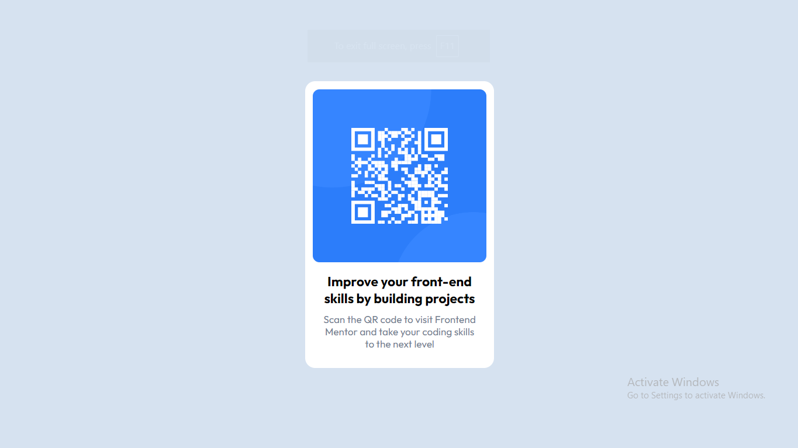

# Frontend Mentor Project 001 - QR code component solution

This is a solution to the [QR code component challenge on Frontend Mentor](https://www.frontendmentor.io/challenges/qr-code-component-iux_sIO_H). Frontend Mentor challenges help you improve your coding skills by building realistic projects.

## Table of contents

- [Overview](#overview)
  - [Screenshot](#screenshot)
  - [Links](#links)
- [My process](#my-process)
  - [Built with](#built-with)
  - [What I learned](#what-i-learned)
  - [Continued development](#continued-development)
- [Author](#author)

## Overview

### Screenshot

### Links

- Solution URL: [QR code component](https://github.com/Shoaib-Bin-Rashid/QR-code-component.git)
- Live Site URL: [QR code component](https://shoaib-bin-rashid.github.io/QR-code-component/)

## My process

I started with solving part by part.
I used both html and css for a certain part then move to the next. At the end I adjusted the css as needed.

### Built with

- Semantic HTML5 markup
- CSS custom properties
- Flexbox
- CSS Grid
- Mobile-first workflow
- [Styled Components](https://styled-components.com/) - For styles

### What I learned

I learned to start taking chanllanges and also how i can store a project professionally which will help me in future.

### Continued development

I want to focus more on creating more complex designs and also designing things on my own time

## Author

- Website - Well I haven't made my profile portfolio, gonna make it sooon when I know a lot of stuffs
- Frontend Mentor - [@Shoaib-Bin-Rashid](https://www.frontendmentor.io/profile/Shoaib-Bin-Rashid)
- Twitter - [@ShoaibBinRashi1](https://x.com/ShoaibBinRashi1)
- Linkedin - [Shoaib Bin Rashid](https://www.linkedin.com/in/shoaib-bin-rashid)
